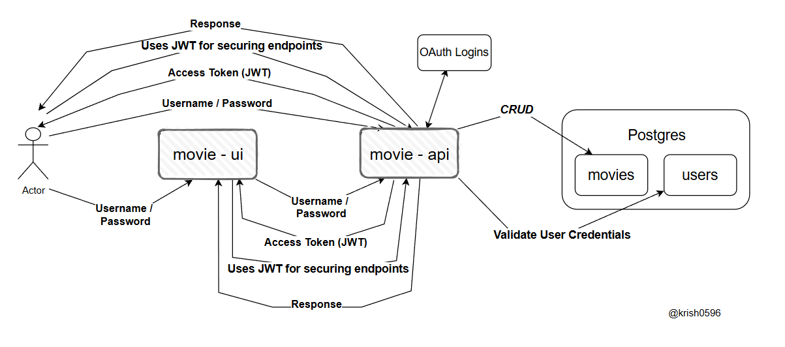

# springboot-movie-management

The goal of this project is to implement an application called movie-app to manage movies. For it, we will implement a back-end Spring Boot application called movie-api and a font-end React application called movie-ui. Besides, we will use OAuth2 (Social Login) to secure both applications.

## Project Diagram

